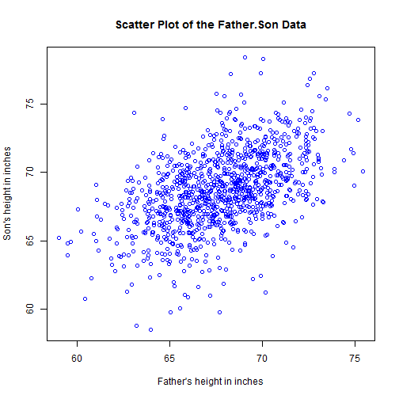

## Overview

### This is the peer assessed assignment for the developing data products course at Coursera. This assignment has two parts: 

### 1. Build data product application by [shiny](http://shiny.rstudio.com/)
### 2. Create data product related presentations by [RPresentation](https://support.rstudio.com/hc/en-us/sections/200130218-R-Presentations) or [slidify](http://slidify.org/)

## The SECOND part is the focus of these slides.

---

## The Application

### This application requires the UsingR and shiny Packages. It makes an interactive plot of the father.son data in the UsingR package. It has been deployed at: https://cwc4shinyapps.shinyapps.io/Project

### The application initiates with a scatter plot. Users are allowed to
### 1. Add or Remove the linear regression line
### 2. Add or Remove user defined line with adjustable intercept and slope.
### 3. R squared value of each line is shown as each line is added on the plot

---

### The [father.son](http://www.inside-r.org/packages/cran/UsingR/docs/father.son) data is in the UsingR package. It contains 1078 measurements of a father's height and his son's height in inches.

 

---

## Main Points

* The R squared value of the linear regreaaion is larger than that of any other straight line.
* The R squared value can be NEGATIVE without without violating any rules of math. Its definition is at https://en.wikipedia.org/wiki/Coefficient_of_determination#Definitions
* A negative R squared simplily means it is a wrong model to interpret the data.

